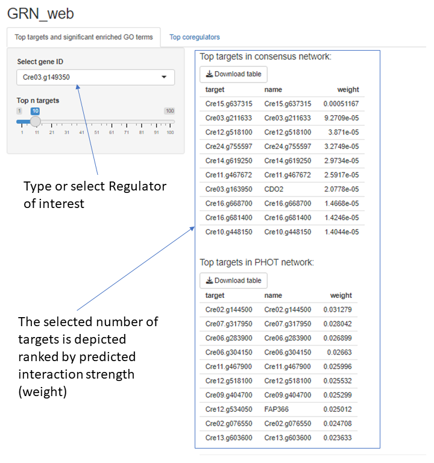
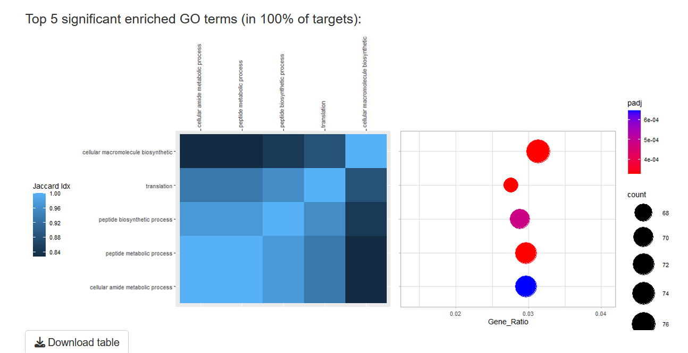
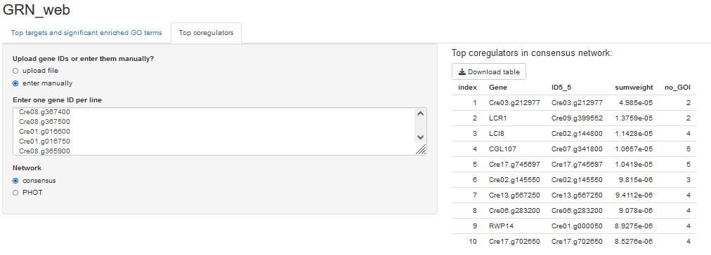
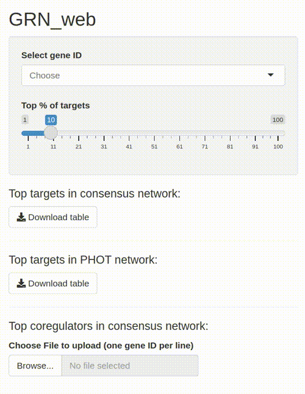

# GRN_web

This repository contains the code for accessing the consensus and PHOT network from the publication ["Widening the landscape of transcriptional regulation of algal photoprotection"](https://www.biorxiv.org/content/10.1101/2022.02.25.482034v3).
via a web interface. The webinterface can be reached at [http://grn-web.bio.uni-potsdam.de/](http://grn-web.bio.uni-potsdam.de/)

You can use the code in this repository to run a local version of the web-interface following the setup instructions below.

## Setup

You have two options:

### Direct Installation

- install R (version 4.0 or higher) [according to your OS installation instructions](https://cran.r-project.org/)
- clone this repository
- change into the `./Program` directory of this repo and run `Rscript setup.R`

### Docker-based Installation

This is mainly useful if you just want to run the GRN_web interface or
if you need to keep your existing R installation untouched.

- install Docker [according to your OS installation instructions](https://docs.docker.com/engine/install/)
- clone this repository
- inside the repository's main directory, run `docker build -t grn-web .` to install GRN_web inside a Docker container
- afterwards, you can start the container like this: `docker run --env PORT=8181 -p 8181:8181 -it grn-web`
- now, visit http://localhost:8181/ in your browser to use GRN_web

### Installation on a server

After following the Docker-based installation, you can also run it on a server.
You can use `systemd` to automatically start `GRN_web` whenever your server starts e.g. by copying `start_grnweb_server.sh` to `/usr/local/bin/start_grnweb_server.sh` and `grn-web.service` to `/etc/systemd/system/grn-web.service`.

Afterwards, enable and start the service like this:

```
sudo systemctl enable grn-web
sudo systemctl start grn-web
```

## Usage example

To use the web interface, change into the `./Program` directory and execute `Rscript app.R 
It will show the URL you need to use in your browser, e.g. `http://127.0.0.1:3395`.
Or you can use our [public server](http://grn-web.bio.uni-potsdam.de/).

### Target predictions
To get target predictions of a regulator you are interested in use the drop-down menu in the "Top targets and significant enriched GO terms" tab to search for its JGI Gene ID.

You can select the number of top targets you want to extract and download them in .xlsx format via the button

### GO enrichment of target genes
The tool will automatically check for GO terms significantly enriched in the set of all target genes and plot information on the 5 GO terms with lowest adjusted p-value. 
 
The left panel gives a heatmap of the pairwise jaccard indes between the genes linked to a given GO term in your targets. The right panel plots the size of ther partition in the whole set of target genes, and indicates the absolut number (dot size) and the Benjamini-Hochberg adjusted p-value (color). The plotted information can be downloaded together with info on all other enriched GO terms via the button.
### Coregulator prediction
You can use the "Top coregulators" tab to enter or upload a list of JGI gene IDs for which the top 10 strongest coregulators will be extracted in a table ready for download as a .xlsx file. 





